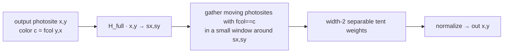
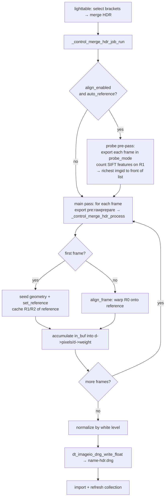
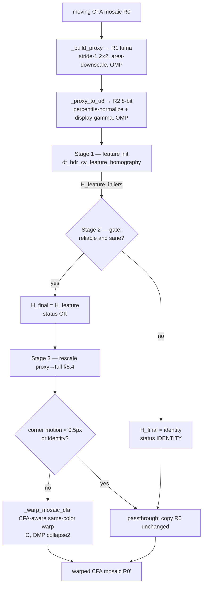
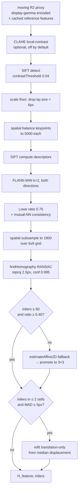
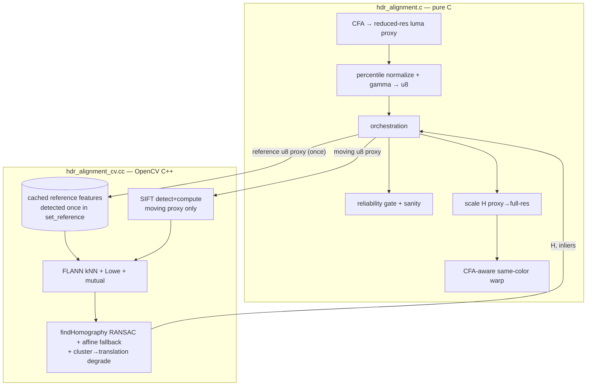
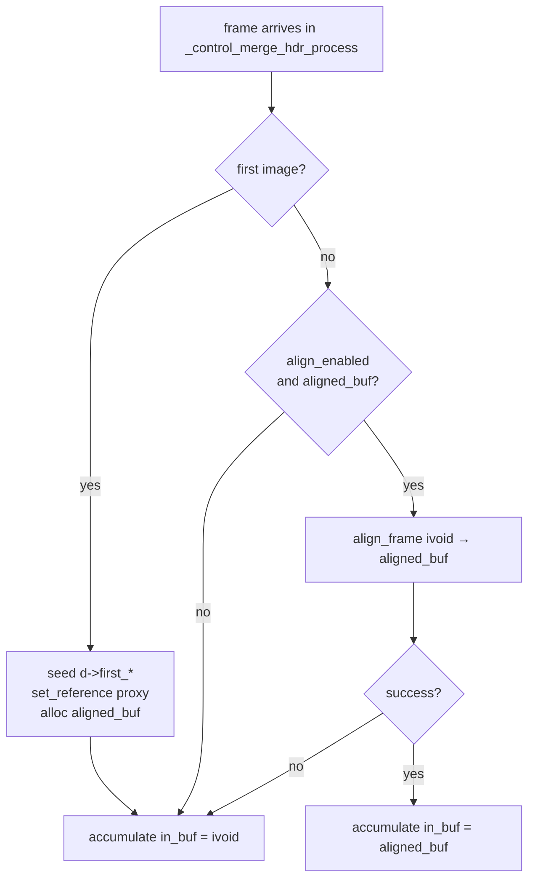

# HDR Merge Auto-Alignment — Design Document

## 1. Current HDR merge in darktable

### 1.1 Entry point and data flow

```
lighttable selected-images menu
  └─ dt_control_merge_hdr()                         src/control/jobs/control_jobs.c:2047
       └─ _control_merge_hdr_job_run()              control_jobs.c:634
            └─ for each selected image:
                 dt_imageio_export_with_flags(..., "pre:rawprepare", ...)
                   └─ _control_merge_hdr_process()   control_jobs.c:468   (per-image callback)
            └─ normalize accumulator by white level  control_jobs.c:678
            └─ dt_imageio_dng_write_float()          → "<name>-hdr.dng"
                                                        (or "<name>-hdr_NN.dng" if it exists)
            └─ dt_image_import() + collection reload
```

The export pipeline is run with the stop point `"pre:rawprepare"`, so the buffer
handed to `_control_merge_hdr_process()` via `ivoid` is the **raw CFA mosaic**:

- single channel (`image.buf_dsc.channels == 1`),
- `float` values, black-subtracted and rescaled to 1.0 saturation,
- still in the Bayer / X-Trans mosaic layout (`image.buf_dsc.filters != 0`).

### 1.2 What the merge does

`_control_merge_hdr_process()` is a **streaming accumulator**. The first image
seeds the geometry (`d->first_imgid`, `d->first_filter`, `d->first_xtrans`,
dimensions, orientation, white-balance, color matrix) and allocates two
full-resolution buffers, `d->pixels` and `d->weight`. Every image — including the
first — is then folded into the accumulator with an exposure/saturation-aware
weight (`_envelope()`), per CFA photosite:

```c
d->pixels[x + wd*y] += w * in * cal;
d->weight[x + wd*y] += w;
```

After all frames, the accumulator is normalized and written as a floating-point
DNG mosaic.

### 1.3 The problem

The accumulation is **purely positional**: photosite `(x, y)` of every frame is
added to accumulator cell `(x, y)`. If the camera moved between exposures, the
scene content at `(x, y)` differs frame-to-frame, so the merged mosaic is a
weighted average of *misaligned* content → ghosting and loss of resolution.

There is currently **no registration step**. The only guard is that all frames
must share size and orientation.

**Goal:** before a non-reference frame is accumulated, estimate the geometric
transform that maps it onto the reference frame and resample its mosaic
accordingly. A shaky tripod / handheld shot needs at least an affine, more
generally a **projective (homography)** transform.


## 2. The darktable-specific challenge: aligning a RAW CFA mosaic

### 2.1 You cannot run SIFT directly on a mosaic

Adjacent samples in a Bayer/X-Trans mosaic belong to different color channels, so
the raw buffer has a strong high-frequency CFA modulation that is *not* scene
structure. A feature detector would lock onto the Bayer grid, not the image.

**Solution — luma proxy.** Collapse the CFA to a single **CFA-free grayscale**
luma image, then resample it to a configurable working scale `DT_HDR_PROXY_SCALE`
(default 0.625× of full resolution):

- The luma at any pixel is the average of a **stride-1 2×2 window**. For *any* 2×2
  patch of a Bayer mosaic, whatever its phase, the four photosites are exactly one
  R, one B and two G, so `0.25·(sum) = (R + 2G + B)/4` — full-resolution luma with
  no interpolation and no colour bias. That full-res luma is then area-averaged
  down to the proxy size.
- X-Trans: a 2×2 patch is not aligned to the 6×6 tile, but the average still
  strongly attenuates the CFA modulation; structural detail (what alignment needs)
  survives. Documented as an approximation; see §8 open questions.

The default scale was raised from the legacy 0.5× toward the Python prototype's
0.627× because the linear raw proxy is far less feature-rich than the prototype's
tone-mapped JPEG (e.g. 4242 vs 43626 raw SIFT keypoints on the same frame); a
higher-resolution proxy recovers distinctive detail and discriminates periodic
structure better, at ≈ `(scale/0.5)²` cost in SIFT time. All feature work happens
on this proxy; the estimated homography is in *proxy coordinates* and is rescaled
to full-resolution mosaic coordinates before being applied (§5.4).

### 2.2 You cannot bilinearly warp a mosaic

Bilinear interpolation of a mosaic mixes neighboring photosites of **different
colors** → false colors and channel cross-talk. The warped buffer must remain a
**valid CFA mosaic in the reference frame's phase** so the existing accumulator
(which assumes photosite `(x,y)` has color `fcol(y,x)`) stays correct.

**Solution — CFA-aware (same-color) resampling.** Both frames come from the same
camera/crop, so they share the CFA layout and phase. To fill output photosite
`(x, y)` (whose color is `c = fcol(y, x)`) we:

1. map it through the full-res homography to a source location `(sx, sy)` in the
   moving mosaic,
2. interpolate **only from moving-mosaic photosites whose color is also `c`**,
   using a width-2 separable tent weight (≈ bilinear on that color's sublattice).

Because we always read color `c` from the source and write it to a cell that is
declared color `c`, the mosaic phase is preserved exactly. This is the key piece
that has no analog in the Python script (which warps RGB).



For Bayer the width-2 tent reduces to exact bilinear on the color's period-2
sublattice. For X-Trans (irregular green lattice) it is a smooth same-color
weighted average — documented as an approximation.

### 2.3 Streaming reference model

The merge processes frames one at a time and never holds all frames in memory.
The alignment state therefore caches the reference's **detected SIFT features**
(keypoints + descriptors, plus the CLAHE'd 8-bit proxy for the optional debug
visuals) and CFA metadata — not the raw proxy. `dt_hdr_alignment_set_reference()`
runs SIFT on the reference **once**, and every non-reference frame matches its own
descriptors against that cache (so the reference is detected once per merge, not
N−1 times) and is accumulated immediately. Both float and 8-bit proxy buffers are
freed after the reference features are built.

**Auto-reference adaptation.** The Python preset picks the richest-feature frame as
reference via a pre-pass (`--auto-reference`). darktable's streaming export does
not naturally allow a cheap pre-pass without exporting twice. Three options were
considered:

- **(A) First frame as reference** — zero extra cost, matches current
  `d->first_imgid` seeding. The default.
- **(B) Middle frame** — the Python default when `--auto-reference` is off.
- **(C) True auto-reference** — a SIFT probe pre-pass over all frames
  (`AUTO_REFERENCE_PROBE_DIM = 1500`), then the normal accumulation pass. Most
  faithful to the preset, one extra decode pass.

**Implemented (T12):** option (A) is the default; option (C) is available behind
the opt-in preference `plugins/lighttable/hdr_merge_auto_reference`. When on, a
pre-pass runs the merge export in `probe_mode` (the process callback just calls
`dt_hdr_alignment_probe_features()` and tracks the richest frame), then the
job moves that `imgid` to the front of `params->index` so it becomes both the
geometry seed and the alignment reference. Default **off** because it doubles the
raw-decode cost; the Python HDR preset has it on, so enabling it reproduces that
behavior.

---

## 3. The image alignment pipeline (as built)

This section is the authoritative, end-to-end description of how a *merge HDR*
action registers and accumulates frames in darktable, as implemented across
`control_jobs.c`, `hdr_alignment.c` and `hdr_alignment_cv.cc`. Sections 1–3
motivate it; sections 5–6 give the code/structure.

### 3.1 Data representations

The pipeline moves a frame through four representations. Knowing which one each
stage consumes is the key to reading the rest of this section.

| # | Representation | Dims | Built by | Consumed by |
|---|----------------|------|----------|-------------|
| R0 | **CFA mosaic** (single-channel float, pre-demosaic, black-subtracted) | full `wd×ht` | `pre:rawprepare` export | accumulation; warp input/output |
| R1 | **luma proxy** (CFA-free, stride-1 2×2 luma, area-downscaled) | `≈ s·wd × s·ht`, `s` = `DT_HDR_PROXY_SCALE` (0.625) | `_build_proxy` (C, OMP) | transient basis for R2 (not cached) |
| R2 | **8-bit SIFT proxy** (percentile-normalized R1, display-gamma, ×255) | same as R1 | `_proxy_to_u8` (C, OMP) | SIFT feature init |
| H | **homography** (row-major `double[9]`) | — | feature init | warp; gate |

`H` exists in two coordinate systems: **proxy** coords (what the feature stage
produces) and **full-res** coords (`H_full = S·H_proxy·S⁻¹`, `S=diag(sx,sy,1)`
with `sx,sy ≈ 1/s`, §5.4) used to warp R0.

### 3.2 Top-level flow



`in_buf` is the reference/raw mosaic for the reference frame and the
warped scratch buffer for every aligned frame; on any alignment failure it falls
back to the raw mosaic, so the accumulator math is untouched.

### 3.3 Per-frame alignment (the core)

`dt_hdr_alignment_align_frame()` registers one moving frame's R0 onto the cached
reference and returns the warped R0.  The SIFT feature-init homography is the
final warp (when it is reliable and sane); there is no separate refinement stage.



### 3.4 Stage 1 — feature initialization (`hdr_alignment_cv.cc`, OpenCV)

Mirrors `estimate_initial_warp_feature_ransac()` for the HDR path. The reference
side of the pipeline (CLAHE → detect → describe → scale floor → spatial balance)
runs **once** in `dt_hdr_cv_features_create()` (called from `set_reference`) and is
cached; only the **moving** frame is detected per call in
`dt_hdr_cv_feature_homography()`. So in the diagram below the "SIFT detect …
balance" chain executes per frame only for the moving proxy — the reference
keypoints/descriptors come straight from the cache:



Output: `H_feature` in proxy coords + inlier count. If SIFT/matches are too few,
returns identity with 0 inliers (the frame is then left unaligned).

**SIFT spatial keypoint balancing (`spatialBalanceKeypoints`, parity with the
Python "SIFT spatial balance" step).** After the scale floor, both keypoint sets
are capped to `kSiftSpatialBalanceTarget` (5000), keeping the strongest (by SIFT
response) in each cell of a frame-spanning grid of ~5000 cells. This was the
decisive fix for a real bracket where the C port locked onto a translation one
structure-period short of the true (large) camera motion: the reference frame had
**12888** surviving keypoints against the moving frame's **5075**, a 2.5×
asymmetry that floods the mutual-NN matcher with near-duplicate candidates and
lets RANSAC consense on an *aliased* small shift (−18 px, with sub-pixel reproj)
instead of the correct large one (−243 px, which Python recovers). Balancing both
sets to a common, spatially-even 5000 (matching Python's `7016→5000 / 6626→5000`)
removes the asymmetry and the local over-density that feed the alias.

**How the linear raw is made detector-friendly (and why *not* CLAHE).** The Python
tool runs on tone-mapped 8-bit JPEGs; darktable runs on the *linear* raw mosaic.
The right transform to bridge that gap is a **display gamma** on the proxy
(`DT_HDR_PROXY_FEATURE_GAMMA`, §3.1): it reproduces the JPEG's tonal encoding and
makes the keypoint count comparable to the prototype's. CLAHE — which an earlier
revision applied unconditionally — is **off by default**, matching the Python HDR
preset (§2.1, "CLAHE: False"): the prototype explicitly disables it because on
*repetitive* textures it changes descriptor signatures between exposures and
manufactures false matches. That is precisely the period-aliasing failure mode
seen on a real façade pair, where CLAHE inflated detection to **279 581** raw
keypoints (vs the prototype's 53 789 on the same frame) and the matcher consensed
on a period-aliased small shift. It remains a runtime knob (`hdr_merge_clahe_clip`)
for genuinely feature-starved / extreme-DR brackets.

**Two further robustness additions beyond the Python HDR path:**

1. **Spatial subsampling before RANSAC** (`spatialSubsample`, 6×6 grid, budget
   `kMaxMatchesForRansac` = 1800). Replaces the old distance cap: distributing
   the matches across the frame keeps RANSAC from being dominated by one dense
   bright region, which otherwise biases the homography.
2. **Cluster degradation** (`degradeClusteredToTranslation`): if the RANSAC
   inliers still fall into ≤ `kClusterDegradeMaxCells` (2) grid cells and their
   per-axis displacement MAD ≤ `kClusterTranslationMaxMad` (5 px), an 8-DOF fit
   overfits scale/shear and extrapolates wildly across the unconstrained rest of
   the frame. The model is then refit as a pure translation from the median
   inlier displacement — the correct, conservative model for a near-translation
   handheld bracket.

These are gated so they cannot hurt the clean case: on a well-featured synthetic
pair neither the subsample nor the cluster-degrade fired (inliers already spanned
the grid).

### 3.5 Stage 2 — reliability gate (`hdr_alignment.c`, C)

A single gate decides whether to apply the feature-init warp `H_feature`:

1. **Reliable** — at least `DT_HDR_FEATURE_MIN_INLIERS` (50) RANSAC inliers.
2. **Sane** (`_warp_is_sane`) — translation < 0.30×diagonal and the 2×2 column-norm
   scale ∈ [0.5, 2.0].

If both hold the warp is applied (`status OK`); otherwise the frame is accumulated
unwarped (`status IDENTITY` — never worse than the legacy, alignment-free merge).

### 3.6 Stage 3 — CFA-aware warp (`hdr_alignment.c`, C, OMP)

`H_final` is rescaled to full-res (§5.4) and applied by `_warp_mosaic_cfa`: for
each output photosite `(x,y)` of CFA color `c`, map through `H_full` to a source
point in the moving R0 and interpolate **only from same-color photosites** with a
width-2 separable tent (≈ bilinear on color `c`'s sublattice). This preserves the
reference frame's mosaic phase, so the warped R0' drops straight into the existing
accumulator. A near-identity `H_final` (corner motion < 0.5 px) short-circuits to
a plain copy to avoid needlessly resampling a frame that did not move.

### 3.7 Where the time goes / parallelism

| Stage | Cost | Threading |
|-------|------|-----------|
| `_build_proxy`, `_proxy_to_u8`, `_percentile_bounds` | full-res read | `DT_OMP_FOR` (C) |
| SIFT detect/describe + RANSAC | seconds (proxy res) | OpenCV internal |
| FLANN kNN (two directions) | proxy res | `omp parallel sections` (two sections) |
| `_warp_mosaic_cfa` | full-res, the hotspot | `DT_OMP_FOR collapse(2)` (C) |

The SIFT detect/describe and RANSAC steps run on OpenCV's own internal threading.
The two FLANN match directions (image→template and template→image, for the
mutual-NN test) are independent, so darktable runs them concurrently in an `omp
parallel sections` block, each building its own matcher. darktable's `DT_OMP_FOR`
covers the per-pixel C hot paths, the heaviest of which is the full-resolution CFA
warp. The `_percentile_bounds` stretch used by `_proxy_to_u8` is two O(n) parallel
reductions (min/max, then a histogram array-reduction) rather than a serial sort.

---

## 4. Proposed architecture

### 4.1 Module layout

```
src/common/hdr_alignment.h       Public C API + OpenCV backend seam (extern "C")
src/common/hdr_alignment.c       Pure-C: proxy build, normalization, warp math,
                                  CFA-aware resample, orchestration, gates
src/common/hdr_alignment_cv.cc   OpenCV (C++) backend: SIFT, FLANN, findHomography,
                                  low-res feature probe
```

### 4.2 The C / C++ split

OpenCV 4's API is **C++ only** (the legacy C `cv.h` API was removed).
A `.c` translation unit cannot include `<opencv2/...>` or call `cv::SIFT`.

The proposed resolution is a **narrow C-ABI seam**:

- `hdr_alignment.c` holds everything that is naturally C and darktable-shaped: CFA
  proxy extraction, percentile normalization, warp matrix algebra, the CFA-aware
  warp, the reliability gate and the per-frame orchestration.
- The primitives that genuinely need OpenCV are declared `extern "C"` in
  `hdr_alignment.h` and implemented in `hdr_alignment_cv.cc`. The reference is
  detected once and cached behind an opaque handle, so the seam is four functions
  rather than a single symmetric detect-both call:

  ```c
  // Detect + cache the reference frame's SIFT features (once per merge).
  void  *dt_hdr_cv_features_create(const uint8_t *proxy, int width, int height,
                                   int balance_target, double clahe_clip);
  void   dt_hdr_cv_features_destroy(void *features);

  // Match a moving proxy against the cached reference features -> homography.
  int    dt_hdr_cv_feature_homography(const void *ref_features, const uint8_t *img,
                                      int width, int height, int balance_target,
                                      double clahe_clip, const char *debug_dir,
                                      int frame_index, double H[9],
                                      dt_hdr_cv_feature_stats_t *stats);

  // Auto-reference probe: SIFT keypoint count on a low-res copy.
  int    dt_hdr_cv_count_features(const uint8_t *luma, int width, int height, int probe_dim);
  ```

  All image data crosses the seam as plain pointers + dimensions; the homography
  crosses as a `double[9]` (row-major); the cached reference crosses as an opaque
  `void *`. No OpenCV type appears in any `.c` or public header. `debug_dir` /
  `frame_index` are owned by the per-merge caller, so no global debug state is
  kept and concurrent merges stay independent.



### 4.3 Public API (`hdr_alignment.h`)

```c
typedef struct dt_hdr_align_t dt_hdr_align_t;   // opaque alignment state

// Runtime-tunable parameters, seeded from the compile-time defaults and
// overridable per run from the user's preferences (see §5).
typedef struct dt_hdr_align_params_t
{
  double proxy_scale;    // feature-proxy size as a fraction of full res
  double feature_gamma;  // display-gamma applied to the 8-bit SIFT proxy (1.0 = off)
  double clahe_clip;     // pre-SIFT CLAHE clip limit (0 = off)
  int    sift_keypoints; // per-frame SIFT budget after spatial balancing
  int    debug_images;   // write per-frame alignment debug visuals (0 = off)
} dt_hdr_align_params_t;

void dt_hdr_alignment_default_params(dt_hdr_align_params_t *p);

// Create/destroy the per-merge state. `params` may be NULL (use defaults); the
// values are clamped to sane ranges and copied. Registration always uses a
// projective (homography) model with an affine fallback on weak support — there
// is no motion-model argument.
dt_hdr_align_t *dt_hdr_alignment_new(const dt_hdr_align_params_t *params);
void            dt_hdr_alignment_free(dt_hdr_align_t *a);

// Cache the reference frame: builds the reduced-res 8-bit luma proxy and runs
// SIFT on it once, storing the detected features (see §2.3).
gboolean dt_hdr_alignment_set_reference(dt_hdr_align_t *a,
                                        const float *mosaic, int width, int height,
                                        uint32_t filters, const uint8_t (*xtrans)[6]);

// Align one non-reference frame onto the reference. On success writes the warped
// mosaic into `out` (caller-allocated, width*height) and returns TRUE. On failure
// (too few features, drift gate, etc.) returns FALSE and copies input → out so the
// caller can fall back to the unaligned frame.
gboolean dt_hdr_alignment_align_frame(dt_hdr_align_t *a,
                                       const float *mosaic, float *out,
                                       int width, int height,
                                       uint32_t filters, const uint8_t (*xtrans)[6],
                                       dt_hdr_align_result_t *info);

// Auto-reference pre-pass: SIFT keypoint count of a frame's proxy at the probe
// resolution, used to pick the richest-feature frame as reference.
int dt_hdr_alignment_probe_features(const float *mosaic, int width, int height);
```

### 4.4 Proxy → full-resolution homography rescale

The proxy is `DT_HDR_PROXY_SCALE` of full resolution, so a full-res point `p_full`
maps to proxy point `p_proxy = S⁻¹ p_full` with `S = diag(sx, sy, 1)`, where
`sx = wd/pw`, `sy = ht/ph` are the actual full-res / proxy size ratios (≈ `1/s`;
kept independent so the integer rounding of `pw,ph` cannot skew the warp). The
homography estimated in proxy coordinates (`H_proxy`, reference→moving) is
converted to full-res with the conjugation:

```
H_full = S · H_proxy · S^-1 ,   S = diag(sx, sy, 1)
```

Concretely, for a row-major 3×3 (`_h_scale_proxy_to_full`):

```
H[0][1] *= sx/sy ;  H[1][0] *= sy/sx                 (cross terms, by aspect)
H[0][2] *= sx ;     H[1][2] *= sy                    (translation)
H[2][0] /= sx ;     H[2][1] /= sy                    (perspective)
```

the isotropic case (`sx = sy`) reduces to the same translation×k / perspective÷k
scaling between resolution levels.

### 4.5 Reliability gate (`_warp_is_sane`)

Applied in `hdr_alignment.c` before committing the feature-init warp:

- **Reliable**: at least `DT_HDR_FEATURE_MIN_INLIERS` (50) RANSAC inliers.
- **Sanity** (`_warp_is_sane`): translation < 0.30 × image diagonal, and the
  upper-left 2×2 column-norm scale within [0.5, 2.0].
- If either fails the frame falls back to **identity** (i.e. accumulate unaligned —
  never worse than today's behavior).

---

## 5. Integration into the merge job

The patch to `_control_merge_hdr_process()` / `_control_merge_hdr_job_run()`
(`src/control/jobs/control_jobs.c`) is additive and behavior-preserving:

1. `dt_control_merge_hdr_t` gains `dt_hdr_align_t *align`, `gboolean
   align_enabled`, a `float *aligned_buf` scratch, and the auto-reference probe
   fields (`probe_mode`, `probe_best_count`, `probe_best_imgid`). (`first_imgid`
   was also retyped `uint32_t → dt_imgid_t`, which it always semantically was.)
2. `_control_merge_hdr_job_run()` first calls `_control_merge_hdr_validate()` on
   the selection, giving a friendly early failure on a non-raw / already-merged /
   monochrome / mismatched-geometry selection before any decode. It then reads the
   opt-in preferences and, only under `#ifdef HAVE_OPENCV`, creates the state,
   seeding the runtime parameters from preferences:
   ```c
   #ifdef HAVE_OPENCV
     d.align_enabled = dt_conf_get_bool("plugins/lighttable/hdr_merge_auto_align");
     if(d.align_enabled)
     {
       dt_hdr_align_params_t p;
       dt_hdr_alignment_default_params(&p);
       p.proxy_scale    = dt_conf_get_float("plugins/lighttable/hdr_merge_proxy_scale");
       p.feature_gamma  = dt_conf_get_float("plugins/lighttable/hdr_merge_feature_gamma");
       p.clahe_clip     = dt_conf_get_float("plugins/lighttable/hdr_merge_clahe_clip");
       p.sift_keypoints = dt_conf_get_int  ("plugins/lighttable/hdr_merge_sift_keypoints");
       p.debug_images   = dt_conf_get_bool ("plugins/lighttable/hdr_merge_debug_images");
       d.align = dt_hdr_alignment_new(&p);
     }
   #endif
   ```
3. In `_control_merge_hdr_process()`, an authoritative per-frame guard re-checks
   the *decoded* descriptor (`filters != 0`, single channel, `TYPE_UINT16`) — the
   flags-only pre-check can lag the decode (§2 of the review). Then, just before
   the accumulation loop, a single `const float *in_buf` selects the source:
   - first frame (`imgid == d->first_imgid`): `dt_hdr_alignment_set_reference()`
     and allocate `aligned_buf`; `in_buf = ivoid`.
   - later frames: `dt_hdr_alignment_align_frame(ivoid → aligned_buf)`; on success
     `in_buf = aligned_buf`, else `in_buf = ivoid`.
   The three existing `((float *)ivoid)[…]` reads in the loop now read `in_buf[…]`.
4. The output filename is de-duplicated: `-hdr.dng`, then `-hdr_01.dng`,
   `-hdr_02.dng`, … so a re-merge never overwrites an earlier result.
5. `_control_merge_hdr_job_run()` cleanup frees `aligned_buf` and `align`.



The patch is intentionally additive: without OpenCV the `#ifdef` leaves
`align_enabled == FALSE`, `in_buf == ivoid`, and the path is byte-for-byte the
current behavior. With OpenCV, it is gated by the preference
`plugins/lighttable/hdr_merge_auto_align` (default **on**, registered in
`data/darktableconfig.xml.in`). Both `d->first_filter` and `d->first_xtrans` are
passed to the aligner — for Bayer `first_filter` is the crop-shifted pattern, for
X-Trans it is `9u` and `first_xtrans` is the crop-adjusted 6×6, which is exactly
what the CFA color lookup needs.

Per-frame diagnostics are emitted via `dt_print(DT_DEBUG_HDR_MERGE, …)`
(inliers / corner drift; enable with `-d hdr_merge`), and a one-shot
`dt_control_log()` informs the user when auto-align is active.

### 5.1 Preferences

All keys live under `plugins/lighttable/` and are registered in
`data/darktableconfig.xml.in` (section *processing → HDR alignment*). The four
numeric knobs seed `dt_hdr_align_params_t` and are clamped in
`dt_hdr_alignment_new()` to the `DT_HDR_*_MIN/MAX` ranges, which are kept in sync
with the `min`/`max` advertised in the XML.

| Key | Type (range) | Default | Effect |
|-----|--------------|---------|--------|
| `hdr_merge_auto_align` | bool | **true** | master switch for the whole feature |
| `hdr_merge_auto_reference` | bool | false | run the auto-reference probe pre-pass (§5.2) |
| `hdr_merge_proxy_scale` | float [0.25, 1.0] | 0.625 | feature-proxy scale (`DT_HDR_PROXY_SCALE`) |
| `hdr_merge_feature_gamma` | float [1.0, 6.0] | 2.2 | proxy display-gamma (`1.0` = off) |
| `hdr_merge_clahe_clip` | float [0.0, 16.0] | 0.0 | pre-SIFT CLAHE clip (`0` = off) |
| `hdr_merge_sift_keypoints` | int [500, 20000] | 5000 | per-frame SIFT budget after balancing |
| `hdr_merge_debug_images` | bool | false | write per-frame debug visuals (§5.3) |

### 5.2 Auto-reference pre-pass

When `hdr_merge_auto_reference` is on and there is more than one frame, an extra
decode sweep runs the export in `probe_mode`: the process callback only calls
`dt_hdr_alignment_probe_features()` and tracks the richest-feature `imgid`, which
is then moved to the front of `params->index` so it becomes both the geometry seed
and the alignment reference (mirrors `align_and_blend.py --auto-reference`). The
sweep advances the progress bar and honors cancellation between frames; it is
opt-in because it doubles the raw-decode cost.

### 5.3 Debug visuals

With `hdr_merge_debug_images` on (or the `DT_HDR_DEBUG_IMAGE_DIR` environment
override), each aligned moving frame writes a numbered set of Netpbm images
(feature-detection input, detected keypoints, and colour-coded matches — green =
inlier, red = outlier) to a per-merge directory resolved once in
`dt_hdr_alignment_new()`. The directory (env or the default under the system temp
dir) is created if missing; the reference-side visuals are written once. The path
and frame index are threaded through the seam, so no global debug state is kept
and concurrent merges do not interfere. Entirely diagnostic.
