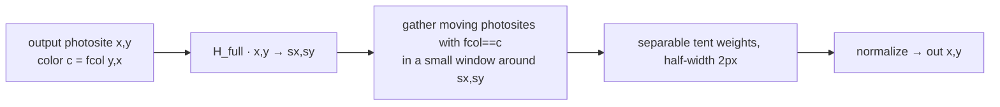
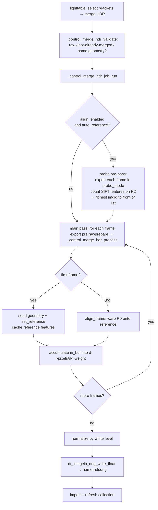
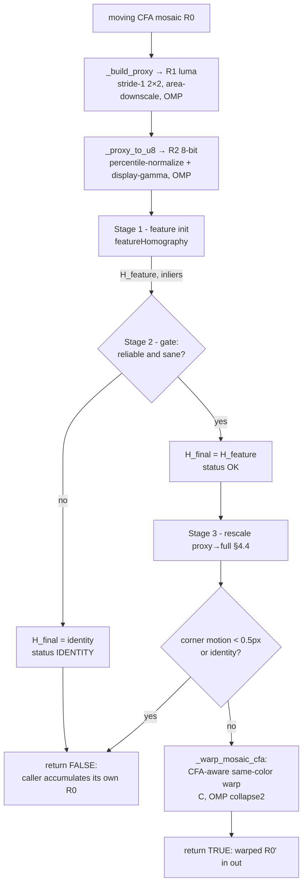
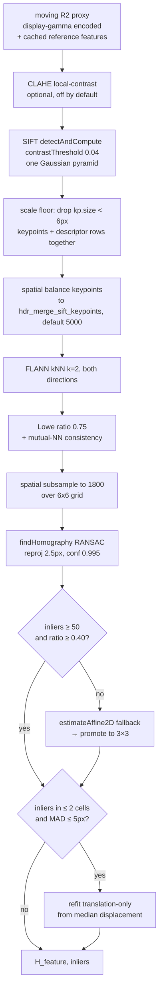
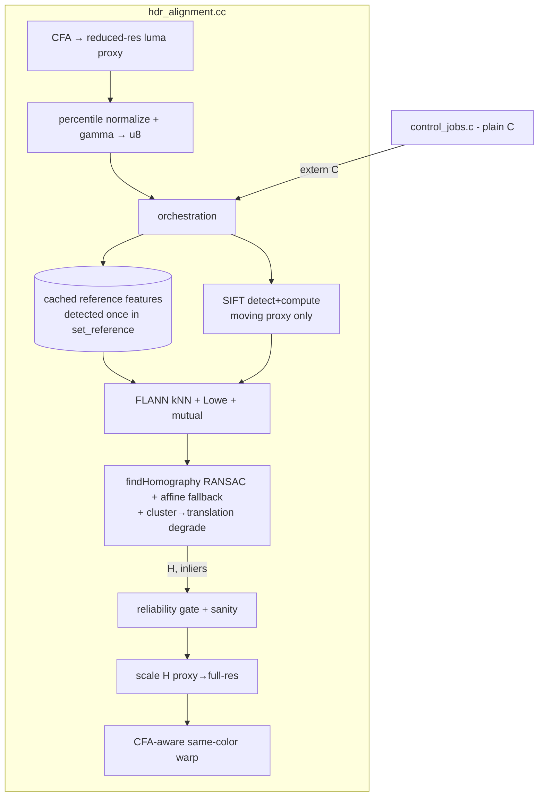
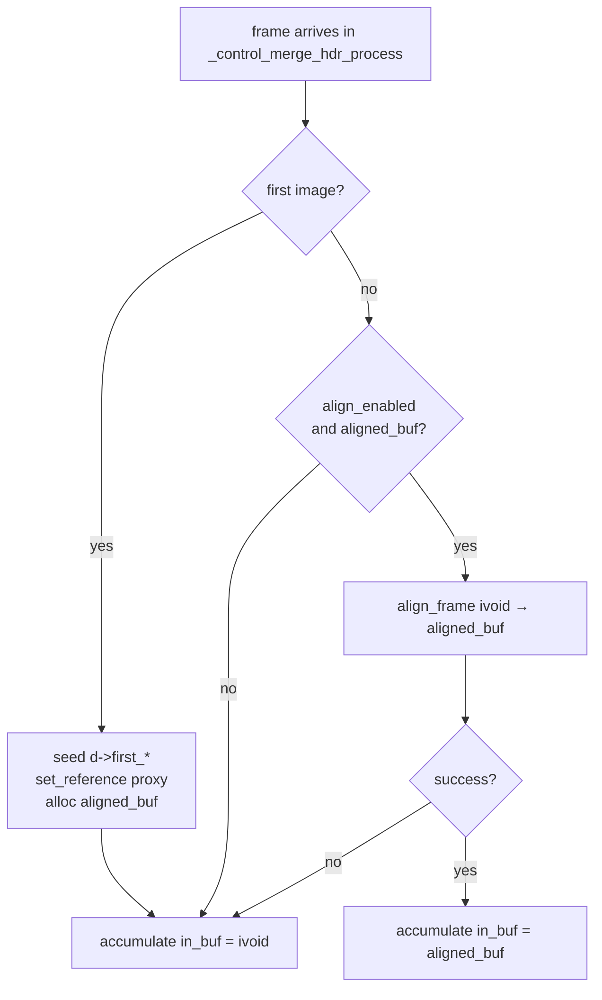

# HDR Merge Auto-Alignment - Design Document

## 1. HDR merge before this change

### 1.1 Entry point and data flow

```
lighttable selected-images menu
  └─ dt_control_merge_hdr()                         src/control/jobs/control_jobs.c
       └─ _control_merge_hdr_job_run()
            └─ for each selected image:
                 dt_imageio_export_with_flags(..., "pre:rawprepare", ...)
                   └─ _control_merge_hdr_process()   (per-image callback)
            └─ normalize accumulator by white level
            └─ dt_imageio_dng_write_float()          → "<name>-hdr.dng"
            └─ dt_image_import() + collection reload
```

The export pipeline is run with the stop point `"pre:rawprepare"`, so the buffer
handed to `_control_merge_hdr_process()` via `ivoid` is the **raw CFA mosaic**:

- single channel (`image.buf_dsc.channels == 1`),
- `float` values, black-subtracted and rescaled to 1.0 saturation,
- still in the Bayer / X-Trans mosaic layout (`image.buf_dsc.filters != 0`).

### 1.2 What the merge does

`_control_merge_hdr_process()` is a **streaming accumulator**. The first image
seeds the geometry (`d->first_imgid`, `d->first_filter`, `d->first_xtrans`,
dimensions, orientation, white-balance, color matrix) and allocates two
full-resolution buffers, `d->pixels` and `d->weight`. Every image - including the
first - is then folded into the accumulator with an exposure/saturation-aware
weight (`_envelope()`), per CFA photosite:

```c
d->pixels[x + wd*y] += w * in * cal;
d->weight[x + wd*y] += w;
```

After all frames, the accumulator is normalized and written as a floating-point
DNG mosaic.

### 1.3 The problem

The accumulation is **purely positional**: photosite `(x, y)` of every frame is
added to accumulator cell `(x, y)`. If the camera moved between exposures, the
scene content at `(x, y)` differs frame-to-frame, so the merged mosaic is a
weighted average of *misaligned* content → ghosting and loss of resolution.

There was **no registration step**. The only guard was that all frames must share
size and orientation.

**Goal:** before a non-reference frame is accumulated, estimate the geometric
transform that maps it onto the reference frame and resample its mosaic
accordingly. A shaky tripod / handheld shot needs at least an affine, more
generally a **projective (homography)** transform.


## 2. The darktable-specific challenge: aligning a RAW CFA mosaic

### 2.1 You cannot run SIFT directly on a mosaic

Adjacent samples in a Bayer/X-Trans mosaic belong to different color channels, so
the raw buffer has a strong high-frequency CFA modulation that is *not* scene
structure. A feature detector would lock onto the Bayer grid, not the image.

**Solution - luma proxy.** Collapse the CFA to a single **CFA-free grayscale**
luma image, then resample it to a configurable working scale `DT_HDR_PROXY_SCALE`
(default 0.625× of full resolution):

- The luma at any pixel is the average of a **stride-1 2×2 window**. For *any* 2×2
  patch of a Bayer mosaic, whatever its phase, the four photosites are exactly one
  R, one B and two G, so `0.25·(sum) = (R + 2G + B)/4` - full-resolution luma with
  no interpolation and no colour bias. That full-res luma is then area-averaged
  down to the proxy size.
- X-Trans: a 2×2 patch is not aligned to the 6×6 tile, but the average still
  strongly attenuates the CFA modulation; structural detail (what alignment needs)
  survives. This is a documented approximation - see §6.

The default scale was raised from the legacy 0.5× because the **linear raw** proxy
is far less feature-rich than the display-referred imagery SIFT is normally fed
(on a real bracket the raw proxy detected 4242 keypoints where a tone-mapped
rendition of the same frame gave 43626). A higher-resolution proxy recovers
distinctive detail and discriminates periodic structure better, at ≈ `(scale/0.5)²`
cost in SIFT time. All feature work happens on this proxy; the estimated
homography is in *proxy coordinates* and is rescaled to full-resolution mosaic
coordinates before being applied (§4.4).

### 2.2 You cannot bilinearly warp a mosaic

Bilinear interpolation of a mosaic mixes neighboring photosites of **different
colors** → false colors and channel cross-talk. The warped buffer must remain a
**valid CFA mosaic in the reference frame's phase** so the existing accumulator
(which assumes photosite `(x,y)` has color `fcol(y,x)`) stays correct.

**Solution - CFA-aware (same-color) resampling.** Both frames come from the same
camera/crop, so they share the CFA layout and phase. To fill output photosite
`(x, y)` (whose color is `c = fcol(y, x)`) we:

1. map it through the full-res homography to a source location `(sx, sy)` in the
   moving mosaic,
2. interpolate **only from moving-mosaic photosites whose color is also `c`**,
   using a separable tent of half-width `DT_HDR_CFA_TENT_RADIUS` (2 px).

Because we always read color `c` from the source and write it to a cell that is
declared color `c`, the mosaic phase is preserved exactly.


```mermaid
flowchart LR
    A[output photosite x,y<br/>color c = fcol y,x] --> B[H_full · x,y → sx,sy]
    B --> C[gather moving photosites with fcol==c<br/>in a small window around sx,sy]
    C --> D[separable tent weights, half-width 2px]
    D --> E[normalize → out x,y]
```

For Bayer the same-color sites of a row sit 2 px apart, so a half-width-2 tent has
exactly two taps per axis with linear weights - i.e. exact bilinear interpolation
on that color's period-2 sublattice. `_sample_bayer_same_color()` exploits this
(step the inner loop by 2, no per-tap colour test) and is asserted bit-for-bit
identical to the general sampler by `test_hdr_alignment_internal`. For X-Trans
(irregular green lattice) the same tent is a smooth same-color weighted average -
a documented approximation, see §6.

### 2.3 Streaming reference model

The merge processes frames one at a time and never holds all frames in memory.
The alignment state therefore caches the reference's **detected SIFT features**
(keypoints + descriptors + a trained FLANN index, plus the 8-bit proxy for the
optional debug visuals) and CFA metadata - not the raw proxy.
`dt_hdr_alignment_set_reference()` runs SIFT on the reference **once**, and every
non-reference frame matches its own descriptors against that cache (so the
reference is detected once per merge, not N−1 times) and is accumulated
immediately. Both the float and the 8-bit proxy buffers are freed once the
reference features are built.

**Auto-reference adaptation.** The reference frame does not have to be the first
one; the best template is the frame richest in features. darktable's streaming
export does not naturally allow a cheap pre-pass without exporting twice. Three
options were considered:

- **(A) First frame as reference** - zero extra cost, matches the existing
  `d->first_imgid` seeding. The default.
- **(B) Middle frame** - a cheap heuristic, usually the mid-exposure frame.
- **(C) True auto-reference** - a SIFT probe pre-pass over all frames
  (`DT_HDR_AUTO_REFERENCE_PROBE_DIM = 1500`), then the normal accumulation pass.
  Most robust, one extra decode pass.

**Implemented:** option (A) is the default; option (C) is available behind the
opt-in preference `plugins/lighttable/hdr_merge_auto_reference`. When on, a
pre-pass runs the merge export in `probe_mode` (the process callback just calls
`dt_hdr_alignment_probe_features()` and tracks the richest frame), then the job
moves that `imgid` to the front of `params->index` so it becomes both the geometry
seed and the alignment reference. Default **off** because it doubles the
raw-decode cost.

---

## 3. The image alignment pipeline (as built)

This section is the authoritative, end-to-end description of how a *merge HDR*
action registers and accumulates frames in darktable, as implemented across
`control_jobs.c` and `hdr_alignment.cc`. Sections 1–2
motivate it; sections 4–5 give the code/structure.

### 3.1 Data representations

The pipeline moves a frame through four representations. Knowing which one each
stage consumes is the key to reading the rest of this section.

| # | Representation | Dims | Built by | Consumed by |
|---|----------------|------|----------|-------------|
| R0 | **CFA mosaic** (single-channel float, pre-demosaic, black-subtracted) | full `wd×ht` | `pre:rawprepare` export | accumulation; warp input/output |
| R1 | **luma proxy** (CFA-free, stride-1 2×2 luma, area-downscaled) | `≈ s·wd × s·ht`, `s` = `DT_HDR_PROXY_SCALE` (0.625) | `_build_proxy` (C, OMP) | transient basis for R2 (not cached) |
| R2 | **8-bit SIFT proxy** (percentile-normalized R1, display-gamma, ×255) | same as R1 | `_proxy_to_u8` (C, OMP) | SIFT feature init |
| H | **homography** (row-major `double[9]`) | - | feature init | warp; gate |

`H` exists in two coordinate systems: **proxy** coords (what the feature stage
produces, and where the sanity gate is applied) and **full-res** coords
(`H_full = S·H_proxy·S⁻¹`, `S=diag(sx,sy,1)` with `sx,sy ≈ 1/s`, §4.4) used to
warp R0.

### 3.2 Top-level flow


```mermaid
flowchart TD
    A[lighttable: select brackets → merge HDR] --> A2[_control_merge_hdr_validate:<br/>raw / not-already-merged / same geometry?]
    A2 --> B[_control_merge_hdr_job_run]
    B --> C{align_enabled<br/>and auto_reference?}
    C -- yes --> D[probe pre-pass:<br/>export each frame in probe_mode<br/>count SIFT features on R2<br/>→ richest imgid to front of list]
    C -- no --> E
    D --> E[main pass: for each frame<br/>export pre:rawprepare → _control_merge_hdr_process]
    E --> F{first frame?}
    F -- yes --> G[seed geometry + set_reference<br/>cache reference features]
    F -- no --> H[align_frame: warp R0 onto reference]
    G --> I[accumulate in_buf into d->pixels/d->weight]
    H --> I
    I --> J{more frames?}
    J -- yes --> E
    J -- no --> K[normalize by white level]
    K --> L[dt_imageio_dng_write_float → name-hdr.dng]
    L --> M[import + refresh collection]
```

`in_buf` is the raw mosaic for the reference frame and the warped scratch buffer
for every aligned frame; on any alignment failure it falls back to the raw mosaic,
so the accumulator math is untouched.

### 3.3 Per-frame alignment (the core)

`dt_hdr_alignment_align_frame()` registers one moving frame's R0 onto the cached
reference and returns the warped R0. The SIFT feature-init homography is the
final warp (when it is reliable and sane); there is no separate refinement stage.


```mermaid
flowchart TD
    A[moving CFA mosaic R0] --> B[_build_proxy → R1 luma<br/>stride-1 2×2, area-downscale, OMP]
    B --> C[_proxy_to_u8 → R2 8-bit<br/>percentile-normalize + display-gamma, OMP]
    C --> D[Stage 1 - feature init<br/>featureHomography]
    D -- H_feature, inliers --> F{Stage 2 - gate:<br/>reliable and sane?}
    F -- yes --> H[H_final = H_feature<br/>status OK]
    F -- no --> J[H_final = identity<br/>status IDENTITY]
    H --> K[Stage 3 - rescale proxy→full §4.4]
    K --> L{corner motion < 0.5px<br/>or identity?}
    L -- yes --> M[return FALSE:<br/>caller accumulates its own R0]
    L -- no --> N[_warp_mosaic_cfa:<br/>CFA-aware same-color warp<br/>C, OMP collapse2]
    J --> M
    N --> O[return TRUE: warped R0' in out]
```

Note the asymmetry on the `FALSE` path: `out` is **not** guaranteed to be
populated. On early rejections it holds a copy of `mosaic`, but for a reliable
sub-pixel warp it is deliberately left untouched to skip a redundant full-frame
copy. Callers must read `mosaic`, not `out`, whenever `FALSE` is returned;
`info->status` still carries the OK/IDENTITY/DISABLED decision either way.

### 3.4 Stage 1 - feature initialization (OpenCV)

The reference side of the pipeline (CLAHE → `detectAndCompute` → scale floor →
spatial balance) runs **once** in `detectReference()` (called from
`set_reference`) and is cached; only the **moving** frame is detected per call in
`featureHomography()`. So in the diagram below the "SIFT
detect+describe … balance" chain executes per frame only for the moving proxy -
the reference keypoints/descriptors come straight from the cache:


```mermaid
flowchart TD
    A[moving R2 proxy<br/>display-gamma encoded<br/>+ cached reference features] --> A2[CLAHE local-contrast<br/>optional, off by default]
    A2 --> B[SIFT detectAndCompute<br/>contrastThreshold 0.04<br/>one Gaussian pyramid]
    B --> C[scale floor: drop kp.size < 6px<br/>keypoints + descriptor rows together]
    C --> C2[spatial balance keypoints<br/>to hdr_merge_sift_keypoints, default 5000]
    C2 --> E[FLANN kNN k=2, both directions]
    E --> F[Lowe ratio 0.75<br/>+ mutual-NN consistency]
    F --> G[spatial subsample to 1800<br/>over 6x6 grid]
    G --> H[findHomography RANSAC<br/>reproj 2.5px, conf 0.995]
    H --> I{inliers ≥ 50<br/>and ratio ≥ 0.40?}
    I -- no --> J[estimateAffine2D fallback<br/>→ promote to 3×3]
    I -- yes --> L
    J --> L{inliers in ≤ 2 cells<br/>and MAD ≤ 5px?}
    L -- yes --> M[refit translation-only<br/>from median displacement]
    L -- no --> K[H_feature, inliers]
    M --> K
```

Detection and description are a single `detectAndCompute()` call so the Gaussian
pyramid is built once; the scale floor and the spatial balance then prune
keypoints *and* their descriptor rows together via `gatherKpDesc()`. Descriptors
computed for later-pruned keypoints are wasted work, but far cheaper than a second
pyramid at the detection counts this path sees.

Output: `H_feature` in proxy coords + inlier count. If SIFT finds too few
keypoints or matches, it returns identity with 0 inliers (the frame is then left
unaligned).

**SIFT spatial keypoint balancing (`spatialBalanceKeep`).** After the scale floor,
both keypoint sets are capped to `hdr_merge_sift_keypoints` (default
`DT_HDR_SIFT_KEYPOINTS` = 5000), keeping the strongest (by SIFT response)
in each cell of a frame-spanning grid of ~5000 cells. This was the decisive fix
for a real bracket that locked onto a translation one structure-period short of
the true (large) camera motion: the reference frame had **12888** surviving
keypoints against the moving frame's **5075**, a 2.5× asymmetry that floods the
mutual-NN matcher with near-duplicate candidates and lets RANSAC consense on an
*aliased* small shift (−18 px, with sub-pixel reprojection error) instead of the
correct large one (−243 px). Balancing both sets to a common, spatially-even
budget removes both the asymmetry and the local over-density that feed the alias.

**How the linear raw is made detector-friendly (and why *not* CLAHE).** SIFT is
tuned for display-referred, tone-mapped imagery; darktable feeds it the *linear*
raw mosaic. The right transform to bridge that gap is a **display gamma** on the
proxy (`DT_HDR_PROXY_FEATURE_GAMMA`, §3.1), which supplies the tonal encoding the
detector expects and brings the keypoint count into a usable range. CLAHE is
**off by default**: on *repetitive* textures it changes descriptor signatures
between exposures and manufactures false matches. That is precisely the
period-aliasing failure mode
seen on a real façade pair, where CLAHE inflated detection to **279 581** raw
keypoints and the matcher consensed on a period-aliased small shift. It remains a
runtime knob (`hdr_merge_clahe_clip`) for genuinely feature-starved / extreme-DR
brackets.

**Two further robustness additions:**

1. **Spatial subsampling before RANSAC** (`spatialSubsample`, 6×6 grid, budget
   `kMaxMatchesForRansac` = 1800). Distributing the matches across the frame keeps
   RANSAC from being dominated by one dense bright region, which otherwise biases
   the homography.
2. **Cluster degradation** (`degradeClusteredToTranslation`): if the RANSAC
   inliers still fall into ≤ `kClusterDegradeMaxCells` (2) grid cells and their
   per-axis displacement MAD ≤ `kClusterTranslationMaxMad` (5 px), an 8-DOF fit
   overfits scale/shear and extrapolates wildly across the unconstrained rest of
   the frame. The model is then refit as a pure translation from the median
   inlier displacement - the correct, conservative model for a near-translation
   handheld bracket.

Both are gated so they cannot hurt the clean case: on a well-featured synthetic
pair neither the subsample nor the cluster-degrade fired (inliers already spanned
the grid).

### 3.5 Stage 2 - reliability gate

A single gate decides whether to apply the feature-init warp `H_feature`:

1. **Reliable** - at least `DT_HDR_FEATURE_MIN_INLIERS` (50) RANSAC inliers.
2. **Sane** (`_warp_is_sane`) - translation < 0.30×diagonal and the 2×2 column-norm
   scale ∈ [0.5, 2.0]. Evaluated in proxy coordinates, before the rescale.

If both hold the warp is applied (`status OK`); otherwise the frame is accumulated
unwarped (`status IDENTITY` - never worse than the legacy, alignment-free merge).

### 3.6 Stage 3 - CFA-aware warp (OMP)

`H_final` is rescaled to full-res (§4.4) and applied by `_warp_mosaic_cfa`: for
each output photosite `(x,y)` of CFA color `c`, map through `H_full` to a source
point in the moving R0 and interpolate **only from same-color photosites** with a
separable half-width-2 tent. This preserves the reference frame's mosaic phase, so
the warped R0' drops straight into the existing accumulator. A near-identity
`H_final` (corner motion < `DT_HDR_NOOP_MAX_CORNER_PX` = 0.5 px) short-circuits to
"no warp" rather than needlessly resampling a frame that did not move.

### 3.7 Where the time goes / parallelism

| Stage | Cost | Threading |
|-------|------|-----------|
| `_build_proxy`, `_proxy_to_u8`, `_percentile_bounds` | full-res read | `DT_OMP_FOR` (C) |
| SIFT detect/describe + RANSAC | seconds (proxy res) | OpenCV internal |
| FLANN kNN (two directions) | proxy res | `omp parallel sections num_threads(2)` |
| `_warp_mosaic_cfa` | full-res, the hotspot | `DT_OMP_FOR collapse(2)` (C) |

The SIFT detect/describe and RANSAC steps run on OpenCV's own internal threading.
The two FLANN match directions (image→template and template→image, for the
mutual-NN test) are independent, so darktable runs them concurrently in an `omp
parallel sections` block capped to two threads. Their KD-trees are **not** rebuilt
symmetrically per frame: the reference (template) index is trained **once** in
`detectReference()` and cached on `RefFeatures`, so the image→template
direction reuses it and only the template→image direction builds a fresh index
over the moving descriptors. darktable's `DT_OMP_FOR` covers the per-pixel C hot
paths, the heaviest of which is the full-resolution CFA warp. The
`_percentile_bounds` stretch used by `_proxy_to_u8` is two O(n) parallel reductions
(min/max, then a 4096-bin histogram array-reduction) rather than a serial sort.

A frame that does not move (reliable warp, sub-pixel corner motion) is accumulated
straight from the caller's source buffer - `align_frame` returns FALSE and skips
the full-resolution copy into the scratch buffer. The auto-reference probe builds
its proxy directly at the probe resolution (`DT_HDR_AUTO_REFERENCE_PROBE_DIM`)
instead of the full `DT_HDR_PROXY_SCALE` proxy, since SIFT there runs at the
smaller size anyway.

---

## 4. Architecture

### 4.1 Module layout

```
src/common/hdr_alignment.h    Public API, extern "C" so C callers can use it
src/common/hdr_alignment.cc   The whole implementation: proxy build, normalization,
                               SIFT/FLANN/RANSAC, warp math, CFA-aware resample,
                               gates, orchestration
```

### 4.2 Why one C++ translation unit

OpenCV 4's API is **C++ only** (the legacy C `cv.h` API was removed), so the
translation unit that calls `cv::SIFT` has to be C++. That is the *only* reason
this code is C++ — nothing else about it needs the language.

No C shim is needed to bridge that. `hdr_alignment.h` is wrapped in `extern "C"`,
which gives every public function C language linkage, so `control_jobs.c` — plain
C — calls the C++ definitions directly. That is the same pattern darktable
already uses for `common/exif.cc`, `common/box_filters.cc` and
`imageio/imageio_rawspeed.cc`.

Keeping the implementation in one translation unit is what lets the per-merge
state own its OpenCV data outright, rather than hiding it behind an opaque
handle with a create/destroy pair:

```cpp
struct dt_hdr_align_t
{
  dt_hdr_align_params_t params;
  std::string debug_dir;                      // empty => debug images off
  int debug_frame;
  std::unique_ptr<RefFeatures> ref_features;  // cached reference SIFT features
  ...
};
```

`dt_hdr_alignment_free()` is therefore just `delete a;`, and no OpenCV type —
nor any struct that exists only to carry OpenCV results across a boundary —
appears in the public header.

Two details are worth knowing if you touch this file:

- `RefFeatures` lives in a **named** namespace (`dt_hdr_align`), not the anonymous
  one that holds the rest of the OpenCV helpers. `dt_hdr_align_t` is declared in
  the public header and therefore has external linkage; a member of
  internal-linkage type trips `-Werror=subobject-linkage`.
- Every function C calls is an exception boundary. The OpenCV helpers catch
  `cv::Exception` and degrade to "no alignment"; `dt_hdr_alignment_new()` uses
  `new(std::nothrow)` and guards the one allocating call it makes.


```mermaid
flowchart TD
    subgraph TU [hdr_alignment.cc]
        direction TB
        P1[CFA → reduced-res luma proxy] --> P2[percentile normalize + gamma → u8]
        P2 --> P3[orchestration]
        P3 --> B0[(cached reference features<br/>detected once in set_reference)]
        P3 --> B1[SIFT detect+compute<br/>moving proxy only]
        B0 --> B2[FLANN kNN + Lowe + mutual]
        B1 --> B2
        B2 --> B3[findHomography RANSAC + affine fallback<br/>+ cluster→translation degrade]
        B3 -- "H, inliers" --> P8[reliability gate + sanity]
        P8 --> P6[scale H proxy→full-res]
        P6 --> P7[CFA-aware same-color warp]
    end
    CJ[control_jobs.c - plain C] -- "extern C" --> P3
```

### 4.3 Public API (`hdr_alignment.h`)

```c
typedef struct dt_hdr_align_t dt_hdr_align_t;   // opaque alignment state

// Runtime-tunable parameters, seeded from the compile-time defaults and
// overridable per run from the user's preferences (see §5.1).
typedef struct dt_hdr_align_params_t
{
  double proxy_scale;    // feature-proxy size as a fraction of full res
  double feature_gamma;  // display-gamma applied to the 8-bit SIFT proxy (1.0 = off)
  double clahe_clip;     // pre-SIFT CLAHE clip limit (0 = off)
  int    sift_keypoints; // per-frame SIFT budget after spatial balancing
  int    debug_images;   // write per-frame alignment debug visuals (0 = off)
} dt_hdr_align_params_t;

void dt_hdr_alignment_default_params(dt_hdr_align_params_t *p);

// Create/destroy the per-merge state. `params` may be NULL (use defaults); the
// values are clamped to sane ranges and copied. Registration always uses a
// projective (homography) model with an affine fallback on weak support - there
// is no motion-model argument.
dt_hdr_align_t *dt_hdr_alignment_new(const dt_hdr_align_params_t *params);
void            dt_hdr_alignment_free(dt_hdr_align_t *a);

// Cache the reference frame: builds the reduced-res 8-bit luma proxy and runs
// SIFT on it once, storing the detected features (see §2.3).
gboolean dt_hdr_alignment_set_reference(dt_hdr_align_t *a,
                                        const float *mosaic, int width, int height,
                                        uint32_t filters, const uint8_t (*xtrans)[6]);

// Align one non-reference frame onto the reference. On success writes the warped
// mosaic into `out` and returns TRUE. Returns FALSE when the caller must
// accumulate the original `mosaic` instead - `out` is NOT guaranteed to be
// populated in that case (see §3.3), so callers read `mosaic`, never `out`.
gboolean dt_hdr_alignment_align_frame(dt_hdr_align_t *a,
                                       const float *mosaic, float *out,
                                       int width, int height,
                                       uint32_t filters, const uint8_t (*xtrans)[6],
                                       dt_hdr_align_result_t *info);

// Auto-reference pre-pass: SIFT keypoint count of a frame's proxy at the probe
// resolution, used to pick the richest-feature frame as reference.
int dt_hdr_alignment_probe_features(const float *mosaic, int width, int height);
```

### 4.4 Proxy → full-resolution homography rescale

The proxy is `DT_HDR_PROXY_SCALE` of full resolution, so a full-res point `p_full`
maps to proxy point `p_proxy = S⁻¹ p_full` with `S = diag(sx, sy, 1)`, where
`sx = wd/pw`, `sy = ht/ph` are the actual full-res / proxy size ratios (≈ `1/s`;
kept independent so the integer rounding of `pw,ph` cannot skew the warp). The
homography estimated in proxy coordinates (`H_proxy`, reference→moving) is
converted to full-res with the conjugation:

```
H_full = S · H_proxy · S^-1 ,   S = diag(sx, sy, 1)
```

Concretely, for a row-major 3×3 (`_h_scale_proxy_to_full`):

```
H[0][1] *= sx/sy ;  H[1][0] *= sy/sx                 (cross terms, by aspect)
H[0][2] *= sx ;     H[1][2] *= sy                    (translation)
H[2][0] /= sx ;     H[2][1] /= sy                    (perspective)
```

the isotropic case (`sx = sy`) reduces to the same translation×k / perspective÷k
scaling between resolution levels.

### 4.5 Reliability gate (`_warp_is_sane`)

Applied before committing the feature-init warp:

- **Reliable**: at least `DT_HDR_FEATURE_MIN_INLIERS` (50) RANSAC inliers.
- **Sanity** (`_warp_is_sane`): translation < 0.30 × image diagonal, and the
  upper-left 2×2 column-norm scale within [0.5, 2.0].
- If either fails the frame falls back to **identity** (i.e. accumulate unaligned -
  never worse than today's behavior).

---

## 5. Integration into the merge job

The patch to `_control_merge_hdr_process()` / `_control_merge_hdr_job_run()`
(`src/control/jobs/control_jobs.c`) is additive and behavior-preserving:

1. `dt_control_merge_hdr_t` gains `dt_hdr_align_t *align`, `gboolean
   align_enabled`, a `float *aligned_buf` scratch, and the auto-reference probe
   fields (`probe_mode`, `probe_best_count`, `probe_best_imgid`). (`first_imgid`
   was also retyped `uint32_t → dt_imgid_t`, which it always semantically was.)
2. `_control_merge_hdr_job_run()` first calls `_control_merge_hdr_validate()` on
   the selection, giving a friendly early failure on a non-raw / already-merged /
   monochrome / mismatched-geometry selection before any decode. It then reads the
   opt-in preferences and, only under `#ifdef HAVE_OPENCV`, creates the state,
   seeding the runtime parameters from preferences:
   ```c
   #ifdef HAVE_OPENCV
     d.align_enabled = dt_conf_get_bool("plugins/lighttable/hdr_merge_auto_align");
     if(d.align_enabled)
     {
       dt_hdr_align_params_t p;
       dt_hdr_alignment_default_params(&p);
       p.proxy_scale    = dt_conf_get_float("plugins/lighttable/hdr_merge_proxy_scale");
       p.feature_gamma  = dt_conf_get_float("plugins/lighttable/hdr_merge_feature_gamma");
       p.clahe_clip     = dt_conf_get_float("plugins/lighttable/hdr_merge_clahe_clip");
       p.sift_keypoints = dt_conf_get_int  ("plugins/lighttable/hdr_merge_sift_keypoints");
       p.debug_images   = dt_conf_get_bool ("plugins/lighttable/hdr_merge_debug_images");
       d.align = dt_hdr_alignment_new(&p);
     }
   #endif
   ```
3. In `_control_merge_hdr_process()`, an authoritative per-frame guard re-checks
   the *decoded* descriptor (`filters != 0`, single channel, `TYPE_UINT16`) -
   `_control_merge_hdr_validate()` can only see the cached image flags, which are
   metadata-derived and can lag what rawspeed actually decodes (a monochrome raw
   in particular carries `DT_IMAGE_RAW` yet decodes to `filters == 0`). Size and
   orientation are re-checked there too. Then, just before the accumulation loop,
   a single `const float *in_buf` selects the source:
   - first frame (`imgid == d->first_imgid`): `dt_hdr_alignment_set_reference()`
     and allocate `aligned_buf`; `in_buf = ivoid`.
   - later frames: `dt_hdr_alignment_align_frame(ivoid → aligned_buf)`; on success
     `in_buf = aligned_buf`, else `in_buf = ivoid`.
   The three existing `((float *)ivoid)[…]` reads in the loop now read `in_buf[…]`.
4. The output filename is de-duplicated: `-hdr.dng`, then `-hdr_01.dng`,
   `-hdr_02.dng`, … so a re-merge never overwrites an earlier result.
5. `_control_merge_hdr_job_run()` cleanup frees `aligned_buf` and `align`.


```mermaid
flowchart TD
    A[frame arrives in _control_merge_hdr_process] --> B{first image?}
    B -- yes --> C[seed d->first_*<br/>set_reference proxy<br/>alloc aligned_buf]
    C --> H[accumulate in_buf = ivoid]
    B -- no --> D{align_enabled<br/>and aligned_buf?}
    D -- no --> H
    D -- yes --> E[align_frame ivoid → aligned_buf]
    E --> F{success?}
    F -- yes --> G[accumulate in_buf = aligned_buf]
    F -- no --> H
```

The patch is intentionally additive: without OpenCV the `#ifdef` leaves
`align_enabled == FALSE`, `in_buf == ivoid`, and the path is byte-for-byte the
current behavior — see §5.4 for why that does not depend on these `#ifdef`s
being right. With OpenCV, it is gated by the preference
`plugins/lighttable/hdr_merge_auto_align` (default **on**, registered in
`data/darktableconfig.xml.in`). Both `d->first_filter` and `d->first_xtrans` are
passed to the aligner - for Bayer `first_filter` is the crop-shifted pattern, for
X-Trans it is `9u` and `first_xtrans` is the crop-adjusted 6×6, which is exactly
what the CFA color lookup needs.

Per-frame diagnostics are emitted via `dt_print(DT_DEBUG_HDR_MERGE, …)`
(inliers / corner drift; enable with `-d hdr_merge`), and a one-shot
`dt_control_log()` informs the user when auto-align is active.

### 5.1 Preferences

All keys live under `plugins/lighttable/` and are registered in
`data/darktableconfig.xml.in` (section *processing → HDR alignment*), gated on the
`opencv` capability so they are greyed out in builds without OpenCV. The four
numeric knobs seed `dt_hdr_align_params_t` and are clamped in
`dt_hdr_alignment_new()` to the `DT_HDR_*_MIN/MAX` ranges, which are kept in sync
with the `min`/`max` advertised in the XML.

| Key | Type (range) | Default | Effect |
|-----|--------------|---------|--------|
| `hdr_merge_auto_align` | bool | **true** | master switch for the whole feature |
| `hdr_merge_auto_reference` | bool | false | run the auto-reference probe pre-pass (§5.2) |
| `hdr_merge_proxy_scale` | float [0.25, 1.0] | 0.625 | feature-proxy scale (`DT_HDR_PROXY_SCALE`) |
| `hdr_merge_feature_gamma` | float [1.0, 6.0] | 2.2 | proxy display-gamma (`1.0` = off) |
| `hdr_merge_clahe_clip` | float [0.0, 16.0] | 0.0 | pre-SIFT CLAHE clip (`0` = off) |
| `hdr_merge_sift_keypoints` | int [500, 20000] | 5000 | per-frame SIFT budget after balancing |
| `hdr_merge_debug_images` | bool | false | write per-frame debug visuals (§5.3) |

### 5.2 Auto-reference pre-pass

When `hdr_merge_auto_reference` is on and there is more than one frame, an extra
decode sweep runs the export in `probe_mode`: the process callback only calls
`dt_hdr_alignment_probe_features()` and tracks the richest-feature `imgid`, which
is then moved to the front of `params->index` so it becomes both the geometry seed
and the alignment reference. The sweep advances the progress bar and honors
cancellation between frames; it is opt-in because it doubles the raw-decode cost.

### 5.3 Debug visuals

With `hdr_merge_debug_images` on (or the `DT_HDR_DEBUG_IMAGE_DIR` environment
override), each aligned moving frame writes a numbered set of Netpbm images
(feature-detection input, detected keypoints, and colour-coded matches - green =
inlier, red = outlier) to a per-merge directory resolved once in
`dt_hdr_alignment_new()`. The directory (env or the default under the system temp
dir) is created if missing; the reference-side visuals are written once. The path
and frame index are per-merge state on `dt_hdr_align_t`, not globals, so
concurrent merges do not interfere. Entirely diagnostic.

### 5.4 Behaviour in a build without OpenCV

The `#ifdef HAVE_OPENCV` blocks in `control_jobs.c` are what stop the merge job
from *reaching* the alignment path, but they are not what makes it safe. The
module refuses from the inside:

**`dt_hdr_alignment_new()` returns NULL when built without OpenCV.** Every other
entry point rejects a NULL state, so a caller that merely checks the return value
— as `_control_merge_hdr_job_run()` already does, clearing `align_enabled` when
the constructor declines — cannot reach any alignment work. A caller that forgot
its `#ifdef` entirely would still do nothing.

That property matters because the entry points are not harmless no-ops in a
half-guarded build. `dt_hdr_alignment_new()` resolves the debug-image directory
and will `mkdir` it when the preference or `DT_HDR_DEBUG_IMAGE_DIR` is set;
`dt_hdr_alignment_set_reference()` would run a full-resolution proxy build plus
percentile and gamma passes, then report success. Neither is reachable now.

Everything except the six public functions is compiled out. The whole
implementation — proxy build, percentile stretch, CFA samplers, warp, gates,
parameter clamps, debug-directory handling — is inside the `HAVE_OPENCV` guard,
so the object file holds 581 bytes of code against 48 700 with OpenCV, and has no
undefined references to `cv::` anything. `test_hdr_align_inert_without_opencv`
asserts the contract in both configurations, and the white-box test has nothing
left to inspect without OpenCV, so it compiles to a trivially passing `main`.

Which way a given binary was built is visible in `darktable --version`, next to
the other optional dependencies:

```
  OpenCV                 -> ENABLED  - HDR bracket auto-alignment is available
  OpenCV                 -> DISABLED - HDR bracket auto-alignment is NOT available
```

## 6. Known approximations and open questions

- **X-Trans luma proxy.** The stride-1 2×2 luma window is exact for Bayer (any
  2×2 patch is 1R/2G/1B) but not for X-Trans, whose 6×6 tile are not 2×2-periodic.
  The residual CFA modulation is small enough that SIFT locks onto scene structure
  rather than the pattern, but the proxy carries a mild colour-dependent ripple.
- **X-Trans same-color resampling.** The half-width-2 tent is exact bilinear on
  Bayer's period-2 sublattice, but on X-Trans's irregular green lattice it is a
  smooth same-color weighted average whose effective kernel varies with position
  inside the tile.
- **Reference features are cached, moving frames are not.** With N frames the
  moving side is detected N−1 times, which is inherent to the streaming accumulator
  (frames are not held in memory).
- **The sanity gate runs in proxy coordinates.** Thresholds are relative
  (fraction of the diagonal, scale ratios), so this is equivalent to gating at
  full resolution, but it is worth remembering when interpreting the logs, which
  report full-resolution warps.

## 7. Tests

Two cmocka binaries, wired up in `src/tests/unittests/CMakeLists.txt`. Both build
and pass with or without OpenCV (§5.4).

| Target | Language | Covers |
|--------|----------|--------|
| `test_hdr_alignment` | **C** | the public API end-to-end: a synthetic Bayer mosaic warped by a known homography must come back better aligned; a CFA-modulated mosaic must warp without channel cross-talk; the reference cache must survive several moving frames; the probe must rank a textured frame above a flat one. Plus `test_hdr_align_inert_without_opencv`, which asserts the §5.4 contract in both configurations; the alignment tests skip themselves when the constructor declines |
| `test_hdr_alignment_internal` | C++ | the static helpers, by `#include`-ing `hdr_alignment.cc`: percentile accuracy against a real sort, the flat-image edge case, `_proxy_to_u8` monotonicity, and the Bayer fast-path sampler being bit-for-bit identical to the general X-Trans one. Without OpenCV those helpers do not exist, so it compiles to a trivially passing `main` |

That `test_hdr_alignment.c` is plain C is deliberate, not an accident of history:
it is what actually pins down that the `extern "C"` interface is callable from C,
which is the whole basis for §4.2.

Two gotchas when editing the C++ test:

- `<cmocka.h>` must be included **after** `common/hdr_alignment.cc`. cmocka
  defines a function-like macro `fail()`, and OpenCV transitively pulls in
  `<iostream>`, whose `std::basic_ios::fail()` the macro would otherwise rewrite
  into a syntax error.
- cmocka.h has **no** C++ linkage guards of its own (the `extern "C"` block near
  its top is MSVC-only), so the include is wrapped in `extern "C"` by hand.
  Without that every `assert_*` resolves to a mangled symbol and the link fails.

Because the test `#include`s the implementation, its own object now contains the
OpenCV calls — it no longer merely links against them. That works because
`src/CMakeLists.txt` links OpenCV into `lib_darktable` as `PUBLIC` and declares
`-DHAVE_OPENCV` plus the OpenCV include path at directory scope, before
`add_subdirectory(tests)`, so both propagate to the test targets.
