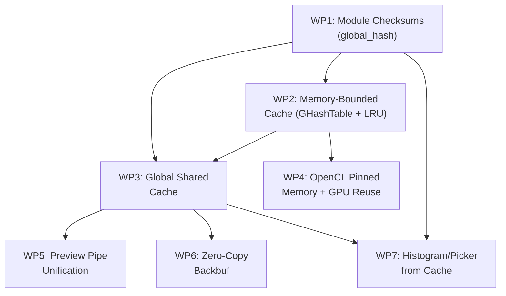

# Porting Ansel's Pipeline Overhaul to Darktable

## Background

Ansel (a darktable fork) introduced a major pixelpipe and caching overhaul that delivers **16–100× speedups** in various interactive scenarios (zoom/pan, module toggling, lighttable round-trip, export). The core theme is _"cache-first architecture"_: make the cache the authoritative registry of valid intermediate results, rather than an afterthought optimization.

This document decomposes the changes into **7 independent work packages**, ordered by decreasing benefit-to-effort ratio, so they can be executed piecewise.

---

## Summary of Ansel Changes

| Change | darktable Status | Ansel Approach |
|--------|-----------------|----------------|
| **Module-level checksums** | `piece->hash` exists but is only params+blend. No cumulative/global hash. | Each piece carries `hash`, `blendop_hash`, and a cumulative `global_hash` folding in all upstream state. Cache keys are deterministic before processing. |
| **Memory-bounded cache** | Cache sized by _entry count_ (`entries`), not by bytes. `memlimit` exists but is only checked opportunistically. Uses `dt_alloc_aligned` per-line. | Cache is a `GHashTable` backed by a **memory arena** (`dt_cache_arena_t`). Size is controlled by actual byte usage, with LRU eviction when full. |
| **Global shared cache** | Each pipe has its own private `dt_dev_pixelpipe_cache_t`. Preview, full, export, thumbnail caches are isolated. | **One global cache** (`darktable.pipeline_threadsafe` mutex). All pipe types share cache lines keyed by `global_hash`. Preview↔full↔export can reuse each other's results. |
| **OpenCL pinned memory & GPU buffer reuse** | Pinned memory only used for tiling. GPU buffers are allocated/freed per module, per run. | Pinned memory (`CL_MEM_USE_HOST_PTR`) extended to normal operations. Cache entries bind RAM + VRAM. GPU buffers are **reused** across pipeline runs. Per-module GPU policy (force cache, bypass GPU, etc). |
| **Preview pipe unification** | Preview pipe runs at a fixed small size. Full pipe runs independently. Two pipe runs on darkroom entry. | Preview pipe dynamically sized to match "fit" zoom. On darkroom entry, **one pipeline** is computed. Back-to-fit zoom is instant (cache hit). |
| **GUI decoupled from pipeline** | Darkroom copies backbuf from pipe. Histograms/pickers piggyback on pipeline execution. Coordinate mapping copy-pasted across modules. | Darkroom borrows backbuf directly from cache (refcounted, zero-copy). Histograms/pickers sample from cache independently. Unified coordinate API. |
| **History→pipeline checksums** | Pipeline validity tracked by `dirty` flags that can be overwritten by multiple threads. | Pipeline carries `history_hash` (atomic). `backbuf.hash` and `backbuf.history_hash` allow instant validity check without re-rendering. |

---

## Work Packages

### WP1: Module-Level Cumulative Checksums (`global_hash`)
**Benefit: ★★★★★ | Effort: ★★☆☆☆ | Risk: Low**

> [!IMPORTANT]
> This is the **single most impactful** change and a prerequisite for most others.

#### What it does
Currently darktable's cache hash is computed walking all pipe nodes up to position N, hashing each `piece->hash` (which itself includes params + blend). This is done _reactively_ during `dt_dev_pixelpipe_cache_hash()` every time a cache lookup happens.

Ansel instead computes a **cumulative `global_hash`** on each piece during synchronization (before processing starts). Each piece's `global_hash = hash(upstream_piece.global_hash, this_piece.hash, this_piece.blendop_hash, roi)`. This means:
- Cache keys are known before any pixel work begins.
- GUI consumers can compute the hash of any module output independently.
- Cache lookups are O(1) hash comparisons instead of O(N) chain walks.

#### Files affected
| File | Change |
|------|--------|
| [pixelpipe_hb.h](file:///Users/dudo/Documents/Coding/darktable/src/develop/pixelpipe_hb.h) | Add `dt_hash_t global_hash` field to `dt_dev_pixelpipe_iop_t` |
| [pixelpipe_cache.c](file:///Users/dudo/Documents/Coding/darktable/src/develop/pixelpipe_cache.c) | Simplify `_dev_pixelpipe_cache_basichash()` to use precomputed `piece->global_hash` |
| [pixelpipe_hb.c](file:///Users/dudo/Documents/Coding/darktable/src/develop/pixelpipe_hb.c) | Add `global_hash` computation pass after `dt_dev_pixelpipe_change()`, before processing. Fold ROI into `global_hash` at processing time. |

#### Step-by-step
1. Add `dt_hash_t global_hash;` to `dt_dev_pixelpipe_iop_t` in `pixelpipe_hb.h` (after `hash` field, line ~50).
2. After `dt_dev_pixelpipe_synch_all()` completes, add a new function `dt_dev_pixelpipe_compute_global_hashes(pipe)` that walks `pipe->nodes` and for each piece computes:
   ```c
   piece->global_hash = dt_hash(DT_INITHASH, &pipe_identity, sizeof(pipe_identity));
   // fold in color profiles
   piece->global_hash = dt_hash(piece->global_hash, &pipe->input_profile_info, sizeof(...));
   // fold in upstream
   if(prev_piece) piece->global_hash = dt_hash(piece->global_hash, &prev_piece->global_hash, sizeof(dt_hash_t));
   // fold in own hash
   piece->global_hash = dt_hash(piece->global_hash, &piece->hash, sizeof(dt_hash_t));
   ```
3. Call this function from `dt_dev_pixelpipe_change()` at the end, after dimensions are computed.
4. Modify `dt_dev_pixelpipe_cache_hash()` to use `piece->global_hash` directly when available, falling back to the current chain-walk for backward compatibility.
5. Initialize `global_hash = DT_INVALID_HASH` in `dt_dev_pixelpipe_create_nodes()`.

---

### WP2: Memory-Bounded Cache with LRU Eviction
**Benefit: ★★★★☆ | Effort: ★★★☆☆ | Risk: Medium**

#### What it does
darktable's cache is a fixed-size array of `entries` slots. Each slot may hold a buffer of varying size, but the number of slots is the controlling dimension (64 for full pipe, 12 for preview). This means:
- You can have 64 slots of 600MB each (38 GB) or 64 slots of 1MB each (64 MB) — no control.
- `memlimit` is checked in `dt_dev_pixelpipe_cache_checkmem()` but only evicts the oldest used entry, so it's reactive and imprecise.
- `_get_oldest_cacheline()` uses a simple age counter, not a proper timestamp.

Ansel uses a `GHashTable` keyed by hash, with real timestamps, refcounting, and strict byte-level bookkeeping. Cache lines are added freely until `max_memory` is reached, then LRU eviction kicks in.

#### Files affected
| File | Change |
|------|--------|
| [pixelpipe_cache.h](file:///Users/dudo/Documents/Coding/darktable/src/develop/pixelpipe_cache.h) | Replace fixed-array struct with `GHashTable`-based struct. Add `dt_pixel_cache_entry_t`. |
| [pixelpipe_cache.c](file:///Users/dudo/Documents/Coding/darktable/src/develop/pixelpipe_cache.c) | Complete rewrite: init/cleanup, get/put, LRU eviction, refcounting, read/write locks. |
| [pixelpipe_hb.h](file:///Users/dudo/Documents/Coding/darktable/src/develop/pixelpipe_hb.h) | Remove `dt_dev_pixelpipe_cache_t cache` from `dt_dev_pixelpipe_t`. Add pointer to global cache or keep local. |
| [pixelpipe_hb.c](file:///Users/dudo/Documents/Coding/darktable/src/develop/pixelpipe_hb.c) | Update all cache access sites to new API. |

#### Step-by-step
1. Define `dt_pixel_cache_entry_t` struct (hash, data, size, age timestamp via monotonic clock, refcount, rwlock, name, pipe-id).
2. Redefine `dt_dev_pixelpipe_cache_t` to contain `GHashTable *entries` (keyed by `uint64_t` hash), `size_t max_memory`, `size_t current_memory`, `dt_pthread_mutex_t lock`.
3. Implement `dt_dev_pixelpipe_cache_init(size_t max_memory)` — creates the hash table and sets the limit from preferences.
4. Implement `dt_dev_pixelpipe_cache_get()` — lookup by hash, if found return data pointer and mark accessed; if not found, create new entry, evict LRU if over budget.
5. Implement `dt_dev_pixelpipe_cache_remove()`, `_flush()`, `_remove_lru()`.
6. Implement `dt_dev_pixelpipe_cache_ref_count_entry()` (increment/decrement), `_rdlock/_wrlock` wrappers.
7. Update `dt_dev_pixelpipe_cache_get()` call sites in `pixelpipe_hb.c` (main processing loop in `dt_dev_pixelpipe_process_rec`).
8. Keep per-pipe entry count as a preference fallback — initially just set `max_memory` from `darktable.dtresources.mipmap_memory`.

> [!WARNING]
> This is the most invasive single change. Every cache access site (30+ locations in `pixelpipe_hb.c`) must be updated. Recommend doing this in stages: first keep per-pipe caches but with the new struct, then merge to global in WP3.

---

### WP3: Global Shared Cache Across All Pipe Types
**Benefit: ★★★★☆ | Effort: ★★★☆☆ | Risk: Medium-High**

> [!IMPORTANT]
> Depends on WP1 (global_hash) and WP2 (new cache struct). This is what enables the biggest user-facing wins: instant darkroom re-entry, cross-pipe cache reuse for export.

#### What it does
Currently each pipe (full, preview, preview2, export, thumbnail) has its own `cache` member. They never share data. Ansel has one global cache that all pipes use. A cache line created by the preview pipe at a given `global_hash` can be found by the full pipe if it happens to request the same hash (same ROI, same params).

Key wins:
- Darkroom entry: only one pipe computed, the other finds results in cache.
- Export after editing: early stages (demosaic, denoise, etc.) are already cached at full resolution.
- Re-export at different size: only downstream of scaling module recomputed.
- Lighttable↔darkroom: no recompute if cache survives.

#### Files affected
| File | Change |
|------|--------|
| [darktable.h](file:///Users/dudo/Documents/Coding/darktable/src/common/darktable.h) | Add `dt_dev_pixelpipe_cache_t *pipeline_cache` to `darktable_t`. |
| [pixelpipe_hb.h](file:///Users/dudo/Documents/Coding/darktable/src/develop/pixelpipe_hb.h) | Remove `dt_dev_pixelpipe_cache_t cache` from `dt_dev_pixelpipe_t`. |
| [pixelpipe_hb.c](file:///Users/dudo/Documents/Coding/darktable/src/develop/pixelpipe_hb.c) | All cache accesses go through `darktable.pipeline_cache` instead of `pipe->cache`. |
| [pixelpipe_cache.c](file:///Users/dudo/Documents/Coding/darktable/src/develop/pixelpipe_cache.c) | `dt_dev_pixelpipe_cache_flush(cache, pipe_id)` takes pipe id to selectively flush. |
| [develop.c](file:///Users/dudo/Documents/Coding/darktable/src/develop/develop.c) | No longer init/cleanup per-pipe caches. |

#### Step-by-step
1. Create global cache at startup in `dt_init()` after resources are determined. Size from `darktable.dtresources` (e.g. 1/4 of available RAM or user-configured).
2. Pass `pipe->type` as `id` parameter to cache operations, so flush can target one pipe type.
3. Add 5-minute garbage collection timer that evicts cache lines not accessed recently (Ansel does this).
4. Modify `dt_dev_pixelpipe_cleanup()` to only flush own pipe's cache lines, not destroy the cache itself.
5. Export and thumbnail pipes get `no_cache = TRUE` flag — they write to cache but lines get auto-destroyed when done. Or better: they _read_ from cache but don't _write_ (saves memory).

---

### WP4: OpenCL Pinned Memory & GPU Buffer Reuse
**Benefit: ★★★☆☆ | Effort: ★★★★☆ | Risk: High**

#### What it does
darktable currently:
- Allocates GPU buffers per module, per processing run
- Only uses `CL_MEM_USE_HOST_PTR` (pinned memory) during tiling
- Copies results from GPU to CPU after each module

Ansel:
- Binds `cl_mem` objects to cache entries — reusable across runs
- Uses pinned memory for all cache-backed modules (not just tiling)
- Per-module heuristic: heavy modules (diffuse, denoise) force-cache to RAM; lightweight modules (exposure, WB) may stay GPU-only
- GPU buffers survive across modules — the next module can read directly from GPU without a CPU round-trip

#### Files affected
| File | Change |
|------|--------|
| [pixelpipe_cache.h/.c](file:///Users/dudo/Documents/Coding/darktable/src/develop/pixelpipe_cache.h) | Add `cl_mem_list` to cache entry. Add `_get_cl_buffer()`, `_release_cl_buffer()`, `_prepare_cl_input()`, `_sync_cl_buffer()`. |
| [pixelpipe_hb.c](file:///Users/dudo/Documents/Coding/darktable/src/develop/pixelpipe_hb.c) | OpenCL processing path: use cache-backed GPU buffers instead of per-invocation alloc/free. |
| [pixelpipe_hb.h](file:///Users/dudo/Documents/Coding/darktable/src/develop/pixelpipe_hb.h) | Add `force_opencl_cache` and `bypass_cache` to piece. |
| [imageop.h](file:///Users/dudo/Documents/Coding/darktable/src/develop/imageop.h) | Optional: add per-module `opencl_cache_policy` callback. |

> [!CAUTION]
> This is the highest-risk change. OpenCL memory management bugs manifest as GPU crashes, data corruption on specific drivers, or non-reproducible hangs. Must be extensively tested across NVIDIA/AMD/Intel GPUs. Recommend implementing behind a preference flag initially.

#### Step-by-step
1. Add `GList *cl_mem_list` and `dt_pthread_mutex_t cl_mem_lock` to `dt_pixel_cache_entry_t`.
2. Implement `dt_dev_pixelpipe_cache_borrow_cl_payload()` — finds matching cached `cl_mem` by host_ptr/devid/dimensions, increments borrow counter.
3. Implement `dt_dev_pixelpipe_cache_return_cl_payload()` — decrements borrow counter.
4. In `pixelpipe_hb.c` OpenCL path, instead of `dt_opencl_alloc_device()` + `dt_opencl_copy_host_to_device()`, check if cache entry has a cached `cl_mem`. If so, borrow it. If not, allocate and register it.
5. On module completion, instead of `dt_opencl_copy_device_to_host()` + `dt_opencl_release_mem_object()`, mark the cl_mem as available for reuse via the cache entry.
6. Add `gboolean force_opencl_cache` to `dt_dev_pixelpipe_iop_t`. Set TRUE for modules that need host-side output (color picker, histogram). Set per user preference or module heuristic.

---

### WP5: Preview Pipe Unification (Dynamic Sizing)
**Benefit: ★★★☆☆ | Effort: ★★★☆☆ | Risk: Medium**

#### What it does
darktable runs two pipes on darkroom entry: a fixed-size small preview pipe and the full pipe at display resolution. Ansel makes the preview pipe match the "fit" zoom resolution of the full pipe. Combined with the global cache, this means:
- Entering darkroom computes only ONE pipe.
- The full pipe at "fit" zoom finds everything already cached.
- Zooming back to "fit" is instant (cache hit).

Additionally, Ansel processes early stages (rawprepare→demosaic→lens→initial resampling) at **full resolution** even in the preview pipe, so those cache lines are reusable when zooming to 100%.

#### Files affected
| File | Change |
|------|--------|
| [develop.c](file:///Users/dudo/Documents/Coding/darktable/src/develop/develop.c) | Change preview pipe input size from fixed to dynamic (match "fit" zoom). |
| [pixelpipe_hb.c](file:///Users/dudo/Documents/Coding/darktable/src/develop/pixelpipe_hb.c) | Consider full-resolution for early pipeline stages. |
| [darkroom.c](file:///Users/dudo/Documents/Coding/darktable/src/views/darkroom.c) | Update coordinate mapping to use unified API instead of preview-specific paths. |

> [!WARNING]
> The fixed preview size is deeply assumed by many coordinate-mapping helpers in mask modules, navigation widget, etc. Ansel had to rewrite the coordinate system to accommodate this. This is a significant secondary effort.

---

### WP6: GUI Decoupling — Zero-Copy Backbuf from Cache
**Benefit: ★★☆☆☆ | Effort: ★★☆☆☆ | Risk: Low-Medium**

#### What it does
darktable copies the pipeline output to `pipe->backbuf` (an `uint8_t*` owned by the pipe). The darkroom view then locks and copies this to display. Ansel instead:
- Stores the final output as a cache entry with refcount.
- The darkroom "borrows" the cache entry directly (increments refcount).
- Displays via Cairo surface bound to the cache data.
- No copy needed. When the pipeline produces new output, the old entry's refcount drops and it becomes evictable.

The `dt_backbuf_t` struct in Ansel carries only metadata (dimensions, hash) — no pixel data. The actual pixels live in the cache.

#### Files affected
| File | Change |
|------|--------|
| [pixelpipe_hb.h](file:///Users/dudo/Documents/Coding/darktable/src/develop/pixelpipe_hb.h) | Change `backbuf` to metadata-only struct with cache entry reference. |
| [pixelpipe_hb.c](file:///Users/dudo/Documents/Coding/darktable/src/develop/pixelpipe_hb.c) | Instead of copying to `pipe->backbuf`, publish cache entry and store hash. |
| [darkroom.c](file:///Users/dudo/Documents/Coding/darktable/src/views/darkroom.c) | Borrow cache entry by hash for display, release after expose. |

#### Step-by-step
1. Define `dt_backbuf_t` with `width`, `height`, `hash`, `history_hash` (no `uint8_t *data`).
2. Replace `pipe->backbuf` with `dt_backbuf_t backbuf`.
3. On pipeline completion, publish the final output cache entry. Store its hash in `backbuf.hash`.
4. In `_darkroom_expose()`, acquire cache entry by `pipe->backbuf.hash`, bind Cairo surface, display, release.
5. Remove `pipe->backbuf_mutex` — cache entry locking handles thread safety.

---

### WP7: Histogram & Color Picker From Cache
**Benefit: ★★☆☆☆ | Effort: ★★☆☆☆ | Risk: Low**

#### What it does
darktable computes histograms/pickers as side effects during pipeline processing. This means changing histogram scope type (raw vs output) requires a pipeline recompute. Ansel samples histograms and color pickers directly from cached module outputs, independently of pipeline execution.

#### Files affected
| File | Change |
|------|--------|
| [histogram.c](file:///Users/dudo/Documents/Coding/darktable/src/common/histogram.c) | Fetch data from cache by module `global_hash` instead of from pipeline side effect. |
| [color_picker.c](file:///Users/dudo/Documents/Coding/darktable/src/common/color_picker.c) | Sample from cache-backed buffer. |
| [libs/histogram.c](file:///Users/dudo/Documents/Coding/darktable/src/libs/histogram.c) | On scope switch, look up appropriate cache line (post-demosaic vs post-output-profile). |

---

## Dependency Graph



## Prioritized Execution Order

| Order | WP | Standalone Benefit | Cumulative Benefit |
|-------|-----|-------------------|-------------------|
| 1 | **WP1** Checksums | Faster cache lookups, cleaner code | Foundation for all others |
| 2 | **WP2** LRU Cache | Better memory control, more cache hits | Cache actually works reliably |
| 3 | **WP3** Global Cache | Cross-pipe reuse, instant re-entry | **This is the game changer** |
| 4 | **WP6** Zero-copy backbuf | Eliminates copy overhead | Smoother darkroom interaction |
| 5 | **WP7** Histogram from cache | No needless recompute for scope changes | Better interactivity |
| 6 | **WP5** Preview unification | One pipe on entry, instant zoom-to-fit | Major perceived speedup |
| 7 | **WP4** OpenCL improvements | 2–7× GPU memory transfer speedup | Best on specific hardware |

## Open Questions

> [!IMPORTANT]
> **Memory budget**: How much RAM should the global cache be allowed to use? Ansel lets users configure it directly (e.g. "8 GB"). darktable currently uses the qualitative "resources" preference. Should we add an explicit byte-level setting, or derive it from the existing resource framework?

> [!IMPORTANT]
> **Export/thumbnail caching policy**: Should export and thumbnail pipes write to the global cache? Ansel does, with auto-destroy on completion. This means a re-export at different size benefits from cache, but at the cost of RAM pressure during batch export. Should this be configurable?

> [!WARNING]
> **Preview pipe sizing**: Unifying preview to match "fit" size (WP5) requires rewriting coordinate mapping in all mask modules, navigation, and crop tools. Ansel reports this was substantial work. Should this be deferred to a later phase, or is the benefit worth the effort?

## Verification Plan

### Automated Tests
- Run `darktable-cli` export with `-d perf` on reference images, compare timing before/after each WP.
- Verify pixel-identical output by comparing exported images (byte-for-byte with `cmp` or perceptual with `dssim`).
- Build with ASan/TSan to catch memory and threading bugs introduced by refcounting/locking changes.

### Manual Verification
- Benchmark scenarios from the Ansel blog post: darkroom entry, zoom 100%, pan, lighttable round-trip, module toggle, color pick, export, re-export at different size.
- Test with GPU enabled and disabled.
- Test with various "resources" settings.
- Monitor actual RAM usage with `htop` / Activity Monitor during the benchmark scenarios.
